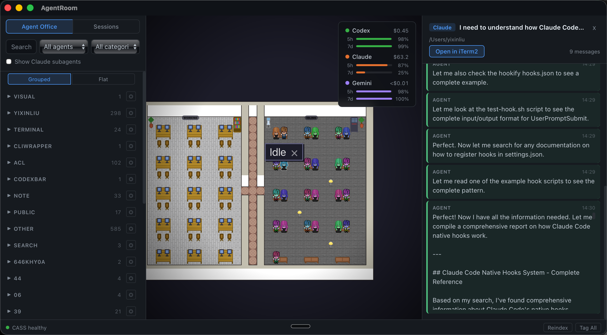

# AgentRoom

A desktop app that turns your AI coding agents into animated pixel art characters in a virtual office — with full session search, transcript browsing, and real-time activity monitoring across Claude Code, Codex, and Gemini.



## Features

- **Real-time agent visualization** — each active coding agent gets its own animated character that types when writing code, reads when searching files, and idles when waiting for input
- **Multi-agent support** — Claude Code, Codex, and Gemini agents displayed simultaneously with distinct visual styles
- **Work & idle rooms** — active agents sit at desks in the Work Room; idle agents walk to the Break Room and hang out on couches
- **Per-project focus** — switch the office view to show only agents working on a specific project
- **Session search & browsing** — search across all agent sessions with full-text search powered by [CASS](https://github.com/Dicklesworthstone/coding_agent_session_search), grouped by project
- **Transcript viewer** — click any session to read the full agent transcript in a side panel, with "Open in iTerm2" to resume
- **Sub-agent visualization** — Task tool sub-agents spawn as separate characters linked to their parent
- **Speech bubbles** — visual indicators when an agent is waiting for input or needs permission approval
- **Sound notifications** — chime when an agent finishes its turn
- **Token usage dashboard** — real-time spend and rate limit tracking for Codex, Claude, and Gemini
- **AI-powered session tagging** — auto-summarize and categorize sessions using Claude or Gemini
- **Persistent layouts** — office design is saved per project

## How It Works

AgentRoom watches the JSONL transcript files that coding agents write to disk. A Rust file watcher (`notify` crate) detects new lines in real time and emits structured events (tool_start, tool_done, turn_end, permission, etc.) to the frontend via Tauri's event system. The React frontend drives a Canvas 2D game engine with BFS pathfinding and a character state machine (idle → walk → type/read).

On first launch, the watcher performs an initial scan of all existing transcript files, emitting a single "discovered" event per agent — so previously-active agents appear in the office without replaying thousands of historical events.

```
JSONL files (Claude/Codex/Gemini)
  → Rust file watcher (notify + tokio)
    → AgentStateManager (event dedup + state tracking)
      → Tauri event bus
        → React useAgentEvents hook
          → OfficeState (Canvas 2D game engine)
```

## Tech Stack

| Layer | Technology |
|-------|-----------|
| **Shell** | [Tauri v2](https://tauri.app/) |
| **Backend** | Rust (tokio, notify, serde_json) |
| **Frontend** | React 18 + TypeScript + Vite |
| **Rendering** | Canvas 2D — pixel-perfect at integer zoom levels |
| **Search/Index** | [CASS](https://github.com/Dicklesworthstone/coding_agent_session_search) (Coding Agent Session Search) |
| **Tilesets** | 32×32px tiles from [SkyOffice](https://github.com/kevinshen56714/SkyOffice) |

## Getting Started

### Prerequisites

- [Rust](https://rustup.rs/) (latest stable)
- [Node.js](https://nodejs.org/) 18+
- [CASS](https://github.com/Dicklesworthstone/coding_agent_session_search) binary built and available
- At least one coding agent (Claude Code, Codex, or Gemini CLI) installed

### Install & Run

```bash
git clone https://github.com/liuyixin-louis/agentroom-visual.git
cd agentroom-visual
npm install
npm run tauri dev
```

### Build for Production

```bash
npm run tauri build
```

The built `.app` / `.dmg` will be in `src-tauri/target/release/bundle/`.

## Project Structure

```
agentroom-visual/
├── src/                        # React frontend
│   ├── office/                 # Game engine
│   │   ├── engine/             # Renderer, characters, pathfinding
│   │   ├── tilesets/           # TilesetManager, background gid map
│   │   ├── sprites/            # Character sprite data
│   │   └── layout/             # Office layout serialization
│   ├── components/             # UI panels (SearchBar, SessionList, etc.)
│   ├── hooks/                  # useAgentEvents (core event bridge)
│   ├── services/               # CASS client, tag service
│   └── bridge.ts               # Tauri invoke/listen bridge
├── src-tauri/                  # Rust backend
│   └── src/
│       ├── file_watcher.rs     # JSONL file watching + initial scan
│       ├── agent_state.rs      # Agent state machine + event emission
│       ├── commands.rs         # Tauri commands (CASS, tags, layout)
│       └── transcript_parser.rs # JSONL line parsing
└── public/assets/              # Tilesets, character sprites
```

## Acknowledgments

AgentRoom builds on the work of several open-source projects:

- **[Pixel Agents](https://github.com/pablodelucca/pixel-agents)** by Pablo de Lucca — the original VS Code extension that pioneered the idea of visualizing coding agents as pixel art characters. AgentRoom's game engine (Canvas 2D renderer, character FSM, BFS pathfinding, speech bubbles) is ported from Pixel Agents.

- **[SkyOffice](https://github.com/kevinshen56714/SkyOffice)** by Kevin Shen — immersive virtual office built with Phaser. AgentRoom uses SkyOffice's 32×32px tileset assets (FloorAndGround, Modern_Office, Generic, Basement) for the office environment graphics.

- **[CASS](https://github.com/Dicklesworthstone/coding_agent_session_search)** (Coding Agent Session Search) by Jeffrey Emanuel — unified search over local coding agent histories. AgentRoom uses CASS as its session indexing and search backend.

- **[LimeZu](https://limezu.itch.io/)** — pixel art assets used in SkyOffice's tilesets.

- **[JIK-A-4 (Metro City)](https://jik-a-4.itch.io/metrocity-free-topdown-character-pack)** — character sprite base used in Pixel Agents, which AgentRoom's character sprites are derived from.

## License

[MIT](LICENSE)
